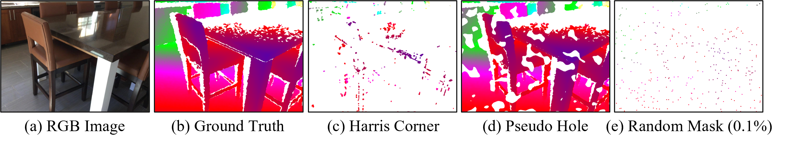

# PSD
Shenglun Chen, Xinzhu Ma, Hong Zhang, Haojie Li, Zhihui Wang. Propagating Sparse Depth via Depth Foundation Model for Out-of-Distribution Depth Completion. Under Reivew

## News

2025-5-28 We upload the testing dataset.

2025-5-26 We upload the pre-trained models.

2025-5-24 We release the main code. Soon, we will upload the test dataset and pre-trained models.

## Installation

### Setting up the environment

The main environment requires adherence to the corresponding foundation model.

>> pip install scikit-image
>> pip install numba
>> pip install tensorboardX
>> pip install omegaconf

### Pre-trained Models
| Model      | Foundation Model  | Version |  Checkpoint  |
| --------   | :-----:  | :----:  | :----: |  
| PSD-NK-M   | [MiDaS](https://github.com/isl-org/MiDaS)             | Swin2 Large | [Download](https://drive.google.com/file/d/1W9q85dDaxRsuKubHTSpOjXXEjOBErSCh/view?usp=drive_link) |
| PSD-NK-D   | [Depth Anything](https://github.com/LiheYoung/Depth-Anything)    | Large       | [Download](https://drive.google.com/file/d/1ynNWqq1POKF0g2JbvroMksPTKdBvP10F/view?usp=drive_link) |  
| PSD-NK-Dv2 | [Depth Anything v2](https://github.com/DepthAnything/Depth-Anything-V2) |  Large      | [Download](https://drive.google.com/file/d/1uzsuLMbldVl9DGNtGFfCs4fZI3umsLVV/view?usp=drive_link) |
| PSD-NK-DPr | [Depth Pro](https://github.com/apple/ml-depth-pro)         |  -          | [Download](https://drive.google.com/file/d/1BAoW_G5WZwsoTbNXnAbTlK3qkg2q_3_P/view?usp=drive_link) |
| PSD-NK-Mev2| [Metric3D v2](https://github.com/YvanYin/Metric3D)       |  Large      | [Download](https://drive.google.com/file/d/1ADCAuotj6g06R0Pp2tmP0xSKfBEk5rjy/view?usp=drive_link) |
| PSD-NK-PDA | [PromptDA](https://github.com/DepthAnything/PromptDA)          |  Large      | [Download](https://drive.google.com/file/d/1ozhjyLL_1Wy6kWaPHi136asskliHhxsE/view?usp=drive_link) |
| PSD-NK-UDv2| [UniDepth v2](https://github.com/lpiccinelli-eth/unidepth)       |  Large      | [Download](https://drive.google.com/file/d/1uypXb_fF6ERMnsS_k04kd-J7dJ81oC1l/view?usp=drive_link) |

N/K denotes the training dataset NYUv2/KITTI.

### Dataset

Training dataset inclues [NYUv2 DC](https://github.com/fangchangma/sparse-to-dense) and [KITTI DC](https://www.cvlibs.net/datasets/kitti/eval_depth.php?benchmark=depth_completion).

Testing datset includes [VOID1500](https://github.com/alexklwong/void-dataset), [SUNRGBD](https://rgbd.cs.princeton.edu/), [TOFDC](https://yanzq95.github.io/projectpage/TOFDC/index.html), [DIML indoor](https://dimlrgbd.github.io/), [DIODE indoor](https://diode-dataset.org/), [Middlebury](https://vision.middlebury.edu/stereo/data/), [ETH3D](https://www.eth3d.net/datasets), [ScanNet](http://www.scan-net.org/), [Drivingstereo](https://drivingstereo-dataset.github.io/), [Argoverse](https://www.argoverse.org/), [Cityscapes](https://www.cityscapes-dataset.com/), [DIODE outdoor](https://diode-dataset.org/), [Hypersim](https://github.com/apple/ml-hypersim), [Virual KITTI](https://europe.naverlabs.com/proxy-virtual-worlds-vkitti-2/), [KITTI 360](https://www.cvlibs.net/datasets/kitti-360/), and [Stanford2D3D](https://redivis.com/datasets/f304-a3vhsvcaf). These dataset can be downloaded from [Huggingface](https://huggingface.co/datasets/cslxx/PSD-val). However, ScanNet requires the [Terms of Use](http://www.scan-net.org/). The sparse depth maps incorporate four patterns: random mask (1%), random mask (0.1%), pseudo-hole, and Harris corner.

## Acknowledgements

Thanks the authors for their works: [CSPN](https://github.com/XinJCheng/CSPN), MiDaS, Depth Anything, Depth Anything v2, Depth Pro, Metric3D v2, PromptDA, UniDepth v2.

## Citation
